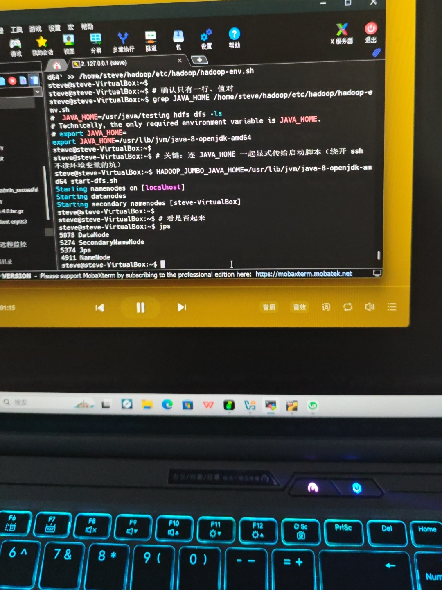
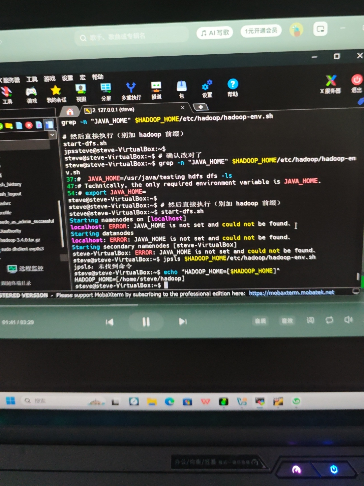

# 从零到 WordCount：VirtualBox + Ubuntu + Hadoop 3.4.0 伪分布式踩坑实录

> 记录一个大数据初学者，用一台 Windows 笔记本，从"虚拟机都装不上"到"跑通第一个 MapReduce 程序"的完整过程。中间踩了十几个坑，全部真实可复现。

## 一、最终成果

先上结果，证明这套流程走得通。[WordCount词频统计结果](图片.jpg)

**jps 进程（HDFS 集群在线）：**

```
NameNode
DataNode
SecondaryNameNode
Jps
```

**WordCount 输出：**

```
hadoop  1
hdfs    1
hello   3
world   1
```

输入文本 `hello hadoop hello world hello hdfs`，`hello` 出现 3 次，其余各 1 次——统计完全正确。这意味着 HDFS 分布式存储 + MapReduce 分布式计算，整条链路全部打通。

## 二、环境

| 项目 | 配置 |
|---|---|
| 宿主机 | Windows 11（机械革命笔记本） |
| 内存 / 硬盘 | 16GB / 512GB SSD |
| 虚拟机软件 | VirtualBox 7.x |
| 虚拟机系统 | Ubuntu 20.04.6 LTS（桌面版） |
| 虚拟机用户 | steve |
| Hadoop | 3.4.0（伪分布式） |
| Java | OpenJDK 1.8.0_452 |
| 网络 | 校园网（桥接被封，改 NAT + 端口转发） |
| 远程工具 | MobaXterm（SSH 连 127.0.0.1:2222） |

## 三、正确的完整流程（精简版，照做能成）

这一节是"如果重来一次，我会这么做"的标准路径。

### 1. 虚拟机网络：NAT + 端口转发（别用桥接）

校园网环境下桥接几乎必然拿不到 IP（封多 MAC / 防共享）。用 NAT 让虚拟机躲在宿主机后上网，再用端口转发把 SSH 映射出来。

VirtualBox 设置 → 网络 → 网卡1 → 连接方式选 **NAT** → 高级 → 端口转发：

| 名称 | 协议 | 主机IP | 主机端口 | 客户机IP | 客户机端口 |
|---|---|---|---|---|---|
| ssh | TCP | 127.0.0.1 | 2222 | （留空） | 22 |

开机后虚拟机内执行 `sudo dhclient enp0s3`，拿到 `10.0.2.x`。

宿主机用 MobaXterm SSH 连 `127.0.0.1:2222`，用户 steve——从此所有操作在 SSH 里做，不再依赖虚拟机图形界面（也就不受共享剪贴板、增强功能那些坑影响）。

### 2. 装 Java 8

```bash
sudo apt update
sudo apt install -y openjdk-8-jdk
java -version   # 确认 1.8.0_xxx
```

真实路径：`/usr/lib/jvm/java-8-openjdk-amd64`

### 3. 装 Hadoop

```bash
# 从 Windows 下载 hadoop-3.4.0.tar.gz，用 MobaXterm 左侧 SFTP 拖进 /home/steve/
cd ~
tar -zxvf hadoop-3.4.0.tar.gz
mv hadoop-3.4.0 hadoop
```

（**别在虚拟机里 wget 官方源**——900MB，校园网下会越下越慢甚至中断；在 Windows 浏览器下好再拖进去，几分钟搞定。）

配置环境变量（写在自己用户下，**不要 sudo -i**）：

```bash
echo 'export HADOOP_HOME=/home/steve/hadoop' >> ~/.bashrc
echo 'export PATH=$PATH:$HADOOP_HOME/bin:$HADOOP_HOME/sbin' >> ~/.bashrc
source ~/.bashrc
```

### 4. 伪分布式配置（两个 XML）

`$HADOOP_HOME/etc/hadoop/core-site.xml`：

```xml
<configuration>
    <property>
        <name>fs.defaultFS</name>
        <value>hdfs://localhost:9000</value>
    </property>
</configuration>
```

`$HADOOP_HOME/etc/hadoop/hdfs-site.xml`：

```xml
<configuration>
    <property>
        <name>dfs.replication</name>
        <value>1</value>
    </property>
</configuration>
```

### 5. SSH 免密（Hadoop 启动要靠 ssh 拉本机节点）

```bash
ssh-keygen -t rsa -P '' -f ~/.ssh/id_rsa
cat ~/.ssh/id_rsa.pub >> ~/.ssh/authorized_keys
chmod 700 ~/.ssh
chmod 600 ~/.ssh/authorized_keys
ssh localhost   # 必须能免密直接进
```

### 6. 关键：让 Hadoop 找到 Java（最容易翻车的一步）

Hadoop 启动脚本通过 ssh 起子进程，**读不到你终端里 export 的变量**，只读 `hadoop-env.sh`。而 Hadoop 自带的 `hadoop-env.sh` 里有个失效占位值 `/usr/java/testing`，必须换成真实路径。

```bash
# 清掉所有 JAVA_HOME 行，只写一条正确的
sed -i '/^export JAVA_HOME/d' $HADOOP_HOME/etc/hadoop/hadoop-env.sh
echo 'export JAVA_HOME=/usr/lib/jvm/java-8-openjdk-amd64' >> $HADOOP_HOME/etc/hadoop/hadoop-env.sh
grep JAVA_HOME $HADOOP_HOME/etc/hadoop/hadoop-env.sh   # 确认只有一行、值对
```

**启动（直接执行脚本，别加 hadoop 前缀）**：

```bash
start-dfs.sh
jps   # 看 NameNode / DataNode / SecondaryNameNode 三个
```

若仍报 JAVA_HOME，用这条兜底（把 Java 路径直接挂到命令前）：

```bash
HADOOP_JUMBO_JAVA_HOME=/usr/lib/jvm/java-8-openjdk-amd64 start-dfs.sh
```

### 7. 格式化 + 跑 WordCount

```bash
hdfs namenode -format        # 首次才做，问 Y/N 时输入 Y
start-dfs.sh
jps

hdfs dfs -mkdir -p /user/steve/input
echo "hello hadoop hello world hello hdfs" | hdfs dfs -put - /user/steve/input/wc.txt
hadoop jar $HADOOP_HOME/share/hadoop/mapreduce/hadoop-mapreduce-examples-3.4.0.jar wordcount /user/steve/input /user/steve/output
hdfs dfs -cat /user/steve/output/part-r-00000
```

## 四、踩坑实录（最有价值的部分）

按时间顺序，每个坑都写清：现象 → 原因 → 解决。

### 坑1：`VERR_INVALID_NAME (-104)` / 虚拟机起不来

- **现象**：VirtualBox 启动报 -104，或提示驱动未加载。
- **原因**：Win11 的 VBS（基于虚拟化的安全性）/ Hyper-V 占用 hypervisor，`vboxsup` 驱动没起来；另外火绒等安全软件也会拦截。
- **解决**：退出 / 卸载火绒；管理员 CMD 执行 `bcdedit /set hypervisorlaunchtype off`；确认注册表 `VBoxSup` 的 Start=2，重启。

### 坑2：中文路径 / 空格 / UUID 冲突

- **现象**：创建虚拟机时报路径或 UUID 错误。
- **原因**：VirtualBox 对中文路径、空格、以及残留的虚拟磁盘 UUID 敏感。
- **解决**：全新安装，虚拟硬盘放 `D:\VMs`（全英文、无空格、无中文）；不要复用旧 vdi。

### 坑3：Ubuntu 安装界面"继续"按钮看不见

- **现象**：安装到"更新和其他软件"那步，底部按钮被挤出屏幕，鼠标拖不动。
- **原因**：VirtualBox 默认 800×600 显示 bug，按钮在可视区外。
- **解决**：`Alt + 鼠标左键拖动窗口` 把按钮拖出来；或纯键盘 `Tab`/`空格` 导航到"继续"按 Enter；或改显存 128MB + 显卡控制器 VBoxSVGA。

### 坑4：桥接拿不到 IP（校园网）

- **现象**：`ip a` 只有 `lo`，`enp0s3` 没有 IPv4。
- **原因**：校园网封多 MAC / 防共享，桥接要独立 IP 被拒。
- **解决**：改 **NAT**，`dhclient enp0s3` 拿 `10.0.2.x`。

### 坑5：虚拟机里 wget 下载 Hadoop 越下越慢

- **现象**：900MB 的包，下到一半从几百 KB/s 掉到几十 KB/s 甚至卡死。
- **原因**：Apache 官方源在国外 + 校园网对长连接大流量动态限速。
- **解决**：**在 Windows 浏览器下好**（或换清华源 `mirrors.tuna.tsinghua.edu.cn`），再用 MobaXterm 左侧 SFTP **直接拖进** `/home/steve/`。不走虚拟机网络，几分钟传完。

### 坑6：共享剪贴板 / 增强功能装不上

- **现象**：改了"双向"还是不能复制粘贴；装增强功能报错。
- **原因**：这些依赖 `apt` 联网下载，而当时网络还没通。
- **解决**：**先通网**；通了之后其实**根本不需要共享剪贴板**——用 MobaXterm SSH 操作，在 Windows 端复制、SSH 窗口里右键粘贴，比剪贴板还方便。这也是大数据开发的真实工作方式。

### 坑7：`sudo -i` 导致环境变量写错用户（反复踩）

- **现象**：明明写了 `JAVA_HOME` / `HADOOP_HOME`，`hadoop version` 还是"未找到命令"。
- **原因**：`sudo -i` 进 root 后，`~` = `/root`，写的是 **root 的 .bashrc**；而你用命令时是 **steve 用户**，读的是 `/home/steve/.bashrc`——两边对不上。
- **解决**：**配自己用户的软件，就在普通用户下配**，永远 `exit` 回 steve，别 `sudo -i` 改 .bashrc。

### 坑8：命令拼错（`rm -o`、`jpsls`、`readlink` 打成 `realnk`）

- **现象**：各种"不适用的选项 -- o"、"未找到命令"。
- **原因**：手打或复制时字符错位（`f`→`o`、`jps ls` 连写、`read`→`real`）。
- **解决**：用 **MobaXterm 复制粘贴**而非手打（Windows 端 `Ctrl+C`，SSH 窗口右键粘贴）；`rm` 永远是 `rm -rf`。

### 坑9：把 Windows 路径当 Linux 命令（`D:\hadoop...`）

- **现象**：`D:\hadoop-3.4.0.tar.gz: 未找到命令`。
- **原因**：SSH 连的是 Linux，不认识 `D:\`。文件路径要用 MobaXterm 的 SFTP 拖拽传输，不是在终端里敲路径。

### 坑10：`JAVA_HOME is not set`（最顽固，卡最久）


- **现象**：`hadoop-env.sh` 里明明有 `export JAVA_HOME=...`，`start-dfs.sh` 还是报 `JAVA_HOME is not set and could not be found`。
- **原因（两层）**：
  1. Hadoop 自带的 `hadoop-env.sh` 里有个**失效占位值 `/usr/java/testing`**，它盖住了正确值；
  2. `start-dfs.sh` 通过 **ssh 到 localhost** 起各节点，ssh 登录**不加载你的终端环境变量**，只认 `hadoop-env.sh` 文件里写死的路径。
- **解决**：
  1. `sed` 清掉文件里所有 `JAVA_HOME` 行，只 `echo` 一条真实的 `/usr/lib/jvm/java-8-openjdk-amd64`；
  2. 启动用 `start-dfs.sh`（别写成 `hadoop start-dfs.sh`，那会把它当 Java 类加载，报 "Could not find main class"）；
  3. 顽固时兜底：`HADOOP_JUMBO_JAVA_HOME=/usr/lib/jvm/java-8-openjdk-amd64 start-dfs.sh`。

### 坑11：格式化时误输入 / 进程残留

- **现象**：格式化卡在 `Re-format filesystem? (Y or N)`，或 `jps` 有残留 NameNode。
- **原因**：之前格式化过、或上次没关干净。
- **解决**：`killall java` 清进程 → `rm -rf /tmp/hadoop-steve` 删旧数据 → 重新 `hdfs namenode -format`（提示 Y/N 时输入 **Y** 并回车）→ `start-dfs.sh`。

## 五、心得体会

1. **环境问题 90% 是路径和权限**——路径指错、用户搞混（root/steve）、变量没持久化。
2. **别在虚拟机图形界面里较劲**——SSH + 命令行才是正道，共享剪贴板、增强功能那些坑自然就绕开了。
3. **Ubuntu 的"最小安装"很干净，但也意味着什么都要自己装**——Java、SSH、Hadoop 全得手动来。
4. **报错不可怕，照着报错查就行**——`Connection refused`（服务没起）、`Permission denied`（免密没配）、`JAVA_HOME is not set`（路径死值 + ssh 丢变量），每个红字背后都是确定的原因。
5. **最值钱的不是"会装 Hadoop"，是"把报错一个个消掉"的能力**——这才是大数据工程师每天真正在做的事。

---

**写在最后**：从下午 4 点到深夜，踩了十几个坑，但每一个都自己啃下来了。如果你也在配环境，希望这篇能帮你少走点弯路。
